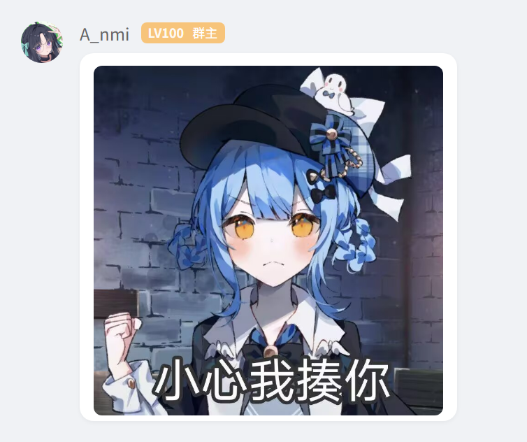
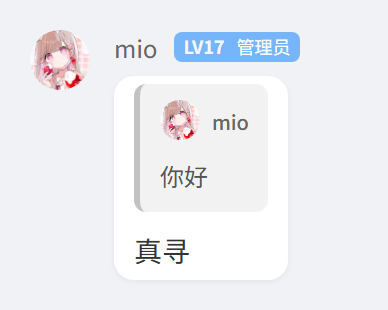
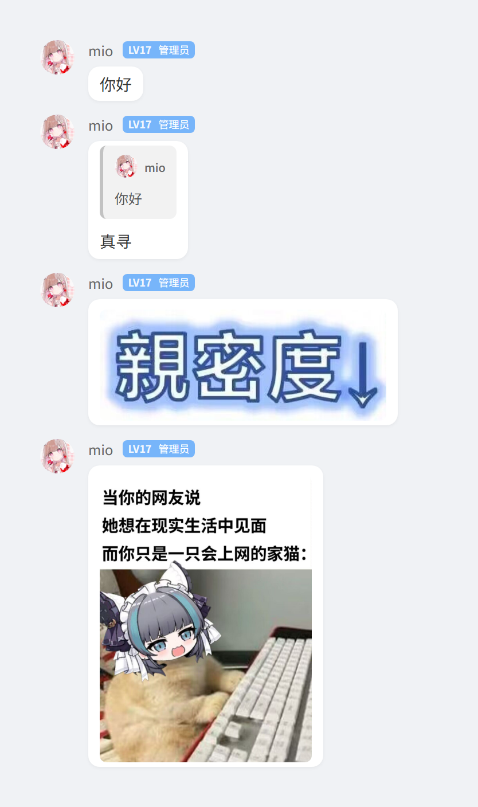

# 🤖 群聊语录 (Quote)

<p align="center">
  <a href="https://github.com/webjoin111/zhenxun_plugin_quote"></a>
  <a href="https://github.com/webjoin111/zhenxun_plugin_quote/blob/main/LICENSE"></a>
  <a href="https://github.com/zhenxun-org/zhenxun_bot"></a>
</p>

一款功能强大的QQ群语录库插件，专为 [真寻（Zhenxun）](https://github.com/zhenxun-org/zhenxun_bot) 机器人框架设计。支持从聊天截图、回复消息中创建语录，并通过关键词、@用户等多种方式精准投放。集成了先进的 AI 视觉模型识别与多种本地 OCR 引擎，并拥有高度可定制的 HTML 主题系统。

本插件是 [nonebot_plugin_quote](https://github.com/RongRongJi/nonebot_plugin_quote) 的真寻机器人适配版本，在原版基础上进行了深度重构、性能优化和大量功能扩展。

## ✨ 功能特性

- **多源录入**: 支持从图片、回复文本消息等多种方式轻松创建语录。
- **智能识别**:
    - **AI 优先**: 优先使用真寻框架集成的多模态大模型（如 Gemini, GLM-4V）进行识别，准确率高，能理解上下文。
    - **OCR 降级**: AI 识别失败或未启用时，自动降级至本地 OCR 引擎。
    - **双引擎保障**: 支持 `EasyOCR` 和 `PaddleOCR`，主引擎失败后自动尝试备用引擎，最大化成功率。
- **灵活查询**:
    - 支持随机、关键词（AND 模式）、`@用户`、`@用户 + 关键词` 等多种组合查询。
    - 查询结果若文件不存在，会自动清理无效数据并尝试返回另一条，具备“数据自愈”能力。
- **强大的主题系统**:
    - **HTML/CSS 驱动**: 语录卡片完全由 HTML 模板生成，美观且易于定制。
    - **主题继承**: 子主题可以继承父主题的模板和样式，只需少量修改即可创建新风格，扩展性极强。
    - **自定义字体**: 主题可捆绑专属字体，实现更丰富的视觉效果。
- **数据统计与排行**:
    - **热门语录**: 生成图文并茂的热门语录排行榜。
    - **用户排行**: 统计“高产上传”和“高产被录”用户，并生成可视化图表。
- **精细化管理**:
    - **标签系统**: 为语录添加、删除、查询标签，方便归类管理。
    - **高级管理**: 提供面向超级用户的批量删除工具，可按关键词、用户、甚至清理已退群成员的语录。
- **持久化存储**: 使用 Tortoise ORM 进行数据库存储，稳定可靠，告别文件IO。

## 📥 安装

### 方式一：通过真寻插件商店

1.  进入真寻机器人 WebUI -> `插件商店`。
2.  搜索 `群聊语录`。
3.  点击 `安装` 并等待完成。
4.  在 `插件管理` 中启用插件。

### 方式二：手动安装

1.  从本仓库下载插件源码（`clone` 或下载 zip）。
2.  将 `quote` 文件夹完整放入真寻机器人的 `plugins` 目录下。
3.  重启真寻机器人。

## ⚙️ 依赖

插件会自动处理大部分依赖。您可能需要根据需求手动安装以下可选依赖：

- **基础 OCR (默认)**:
    ```bash
    pip install easyocr
    ```

- **可选的高性能 OCR**: (推荐，但安装可能较复杂)
    ```bash
    # 安装 PaddlePaddle 核心库（请根据您的环境选择合适的版本，CPU/GPU）
    pip install paddlepaddle
    # 安装 PaddleOCR
    pip install paddleocr
    ```

- **分词优化**: (用于更精准的中文标签和搜索)
    ```bash
    pip install spacy_pkuseg
    ```

## 🛠️ 配置项
所有配置均可在真寻机器人 WebUI -> `配置中心` -> `quote` 模块下进行修改。

| 配置项               | 说明                                                                                                         | 默认值                                       |
| :------------------- | :----------------------------------------------------------------------------------------------------------- | :------------------------------------------- |
| `OCR_ENGINE`         | 本地 OCR 引擎选择。可选值：`easyocr`, `paddleocr`。                                                          | `easyocr`                                    |
| `OCR_USE_GPU`        | 是否为本地 OCR 引擎启用 GPU 加速。                                                                           | `False`                                      |
| `AI_ENABLED`         | **[推荐]** 是否启用 AI 识别。启用后将优先使用真寻的 LLM 服务，失败后降级到本地 OCR。                         | `False`                                      |
| `OCR_AI_MODEL`       | 用于图片识别的多模态大模型。格式为 `ProviderName/ModelName`。需在真寻的 `AI` 配置组中配置好对应的 Provider。 | `Gemini/gemini-2.5-flash-lite-preview-06-17` |
| `QUOTE_PATH`              | 语录图片保存路径。留空则使用默认路径 `data/quote/images`。                                                   | `""`                                         |
| `THEME`             | 生成语录卡片时默认使用的主题/皮肤名称。                                                                      | `qq-native`                                  |
| `QUOTE_TEXT_ONLY_THEME`   | 仅用于纯文本（可包含@）的单条语录的主题。留空则默认使用 `THEME`。                                      | `""`                                         |
| `QUOTE_ALLOW_SELF_RECORD` | 是否允许用户使用「记录」命令记录自己的消息。                                                                  | `False`                                      |
| `DELETE_ADMIN_LEVEL`      | 使用 `删除` 命令所需的权限等级（0:群员, 1:管理员, 2:群主, 5:群管及以上）。                                   | `5`                                          |

> **注意**: AI 识别功能依赖于真寻框架的 `llm` 服务。请确保您已在 WebUI -> `配置中心` -> `AI` 模块下正确配置了至少一个支持视觉功能的大模型提供商（如 Gemini, GLM-4V 等）。

## 📖 使用说明

### 核心功能 (所有用户)

-   `语录`：随机发送一条语录。
-   `语录 [关键词]`：搜索包含指定关键词的语录。
-   `语录 [词1] [词2]`：搜索同时包含所有关键词的语录 (AND逻辑)。
-   `语录 @用户`：随机发送指定用户的语录。
-   `语录 @用户 [关键词]`：搜索指定用户包含关键词的语录。
-   `上传 [图片]`：上传图片作为语录。
-   `上传` (回复图片消息)：将回复的图片上传为语录。
-   `记录` (回复文本消息)：将回复的文本生成语录图片并保存。
-   `记录 -n [数量]` (回复消息)：记录连续的多条消息（需要指定结尾消息）。

### 主题与生成

-   `语录主题` / `quote theme`（超级用户）：查看所有可用的语录卡片主题（带序号，可在群聊或私聊执行）。
-   `语录主题 [主题名/序号]` / `quote theme [主题名/序号]`（超级用户）：切换全局默认的语录主题。
-   `记录 -s [主题名/序号]`：在记录时使用指定主题生成图片（支持主题名或序号）。
-   `生成` (回复文本消息)：预览生成的语录图片，但不会保存。
-   `生成 -s [主题名/序号]`：使用指定主题进行预览。
-   `生成 -n [数量]` (回复消息)：预览连续多条消息的语录（不保存）。

### 统计功能

-   `quote stats hot [数量]` / `语录 统计 热门 [数量]`：显示群内热门语录排行（默认10条）。
-   `quote stats top-uploaders [数量]` / `语录 统计 高产上传 [数量]`：显示上传语录最多的用户排行。
-   `quote stats top-quoted [数量]` / `语录 统计 高产被录 [数量]`：显示被记录语录最多的用户排行。
> 超级用户可使用 `-g [群号]` 在任意位置查询指定群的统计。

### 管理功能

#### 删除命令（按配置权限）
-   `删除` / `del` (回复由机器人发送的语录图片)：删除被回复的语录及其图片文件，仅在满足 `DELETE_ADMIN_LEVEL` 权限要求时生效；权限不足时将静默忽略。

#### 高级管理 (超级用户权限)
-   `quote manager keyword [词1] [词2]...` / `语录管理 删除关键词 [词1] [词2]...`
    > 删除包含任一关键词的语录（OR逻辑）。
    > 可附加 `--uploader [@/QQ号]` 或 `--quoted [@/QQ号]` 进行筛选。
-   `quote manager clear --uploader [@/QQ号]` / `语录管理 清空全部 --uploader [@/QQ号]`
    > 删除指定上传者的所有语录。
-   `quote manager clear --quoted [@/QQ号]` / `语录管理 清空全部 --quoted [@/QQ号]`
    > 删除被记录的指定用户的所有语录。
-   `quote manager clear --group [群号]` / `语录管理 清空全部 --group [群号]`
    > **[高危]** 删除指定群号的所有语录。
-   `quote manager cleanup` / `语录管理 清理 退群用户`
    > 自动清理所有已退群用户的相关语录。
-   `quote manager ... -g [群号]`
    > 在任意位置对指定群聊执行上述高级管理操作。

---

## 🚀 引擎对比与选择建议

| 特性           | AI 视觉模型 (推荐)     | PaddleOCR            | EasyOCR              |
| :------------- | :--------------------- | :------------------- | :------------------- |
| **准确率**     | **最高**               | 较高                 | 中等                 |
| **识别速度**   | 受网络影响             | 较快                 | 较慢                 |
| **安装难度**   | **无需额外安装**       | 复杂                 | 简单                 |
| **资源占用**   | **极低 (云端处理)**    | 较高                 | 中等                 |
| **上下文理解** | **是**                 | 否                   | 否                   |
| **适用场景**   | 复杂截图、手写、艺术字 | 快速本地识别、无网络 | 基础识别、低配置环境 |

**最佳实践**: 启用 `AI_ENABLED`，并将 `OCR_ENGINE` 设置为 `paddleocr`。这样可以享受 AI 带来的高准确率，同时在 AI 服务不可用时，拥有一个强大的本地备用方案。


---
## 🎨 主题系统详解

本插件的特色之一就是基于HTML的强大主题系统。您可以轻松创造属于自己风格的语录卡片。

### 🖼️ 内置主题预览

插件内置了三种精美主题，每种都有独特的视觉风格：

#### 📖 Classic (经典黑)
<div align="center">
  
</div>

- **风格**: 简洁优雅的黑色主题
- **特点**: 经典的设计，适合各种场景
- **主题ID**: `classic`

#### 💬 QQ Native (QQ原生)
<div align="center">
  
  <p><i>包含图片的消息</i></p>
</div>

<div align="center">
  
  <p><i>包含引用的消息</i></p>
</div>

<div align="center">
  
  <p><i>连续消息</i></p>
</div>

- **风格**: 高度还原QQ聊天界面
- **特点**: 支持图片、引用消息、连续消息的原生渲染
- **主题ID**: `qq-native`


### 🎨 主题选择说明

插件采用模块化的组件系统来渲染语录卡片。您可以：

1. **使用 `quote theme` 命令**（超级用户）：查看所有可用主题，每个主题都有对应的序号，可在群聊或私聊执行。
2. **使用主题名称**：例如 `记录 -s classic` 或 `语录主题 classic`。
3. **使用主题序号**：例如 `记录 -s 1` 或 `语录主题 1`（序号更快捷）。
4. **设置默认主题**：超级用户可使用 `语录主题 [名称/序号]` 将全局默认主题切换为指定样式。
5. **纯文本专属主题**：在配置中设置 `QUOTE_TEXT_ONLY_THEME`，为纯文本语录指定专属主题。

> **提示**：主题组件位于 `quote/assets/components/` 目录，开发者可参考现有组件创建自定义主题；切换默认主题会同步影响所有群聊的语录渲染样式。

---
## 🤔 常见问题 (FAQ)

1.  **Q: 搜索功能好像不太准？**
    A: 请务必安装 `spacy_pkuseg` 依赖。没有它，插件无法进行中文分词，只能进行简单的全文匹配，效果会差很多。

2.  **Q: AI识别功能不工作怎么办？**
    A: 请检查以下几点：
    - 插件配置中 `AI_ENABLED` 是否已开启。
    - 真寻后台的 **[AI设置]** 中是否已正确配置了支持视觉的模型（如Gemini、GLM-4V等）。
    - 您的API Key是否有效且额度充足。
    - 检查机器人日志，看是否有相关的API错误信息。

3.  **Q: 安装PaddleOCR时出错或启动时提示缺少 `shm.dll` 等文件？**
    A: PaddleOCR的安装在Windows上可能比较复杂。
    - **首选方案**: 放弃PaddleOCR，使用 `easyocr`。它的兼容性最好，安装最简单。
    - **尝试解决**: 确保您已安装最新的 [Visual C++ Redistributable for Visual Studio](https://aka.ms/vs/17/release/vc_redist.x64.exe)，并检查PyTorch等相关库是否与您的CUDA版本匹配。如果问题复杂，切换到`easyocr`是更高效的选择。
---


## 📝 更新日志

### 🎉 v1.1.0 - UI系统重构与命令增强

#### 🎨 UI渲染系统重构
- 🏗️ **模块化UI系统**：引入全新的组件化UI渲染架构，替换旧版主题机制
  - 新增 `components` 目录存放语录卡片组件（`classic`, `qq-native`）
  - 新增 `pages` 目录存放统计页面组件（`hot_quotes`, `quote-sequence-page`）
  - 注册 `@quote` 模板命名空间至渲染服务，实现动态UI渲染
- 📋 **数据模型规范**：新增 `QuoteCardData`, `QuoteSequenceData`, `HotQuotesPageData` 等 Pydantic 模型
- 🗑️ **移除旧版资源**：废弃 `templates` 和 `themes` 目录下的旧版HTML/CSS模板

#### ⚡ 命令系统增强
- 🔄 **命令结构优化**：
  - 合并 `删除`, `addtag`, `deltag` 命令至统一的 `quote manage` 命令组
  - `语录统计` 更新为子命令结构（`quote stats hot/top-uploaders/top-quoted`）
- 📝 **连续消息记录**：`记录` 和 `生成` 命令新增 `-n|--num` 选项，支持连续多条消息语录生成
- 🎯 **主题选择增强**：
  - 支持通过 `-s [主题序号]` 使用数字快速选择主题
  - 新增纯文本消息专属主题配置（`QUOTE_TEXT_ONLY_THEME`）
  - `quote theme` 命令支持使用序号或名称切换主题
- 🎨 **渲染能力提升**：优化消息内容解析，支持 `@` 提及、内联图片和嵌套引用消息渲染

#### ⚙️ 配置与优化
- 🆕 **新增配置项**：
  - `QUOTE_TEXT_ONLY_THEME`：为纯文本（含@）单条语录指定专属主题
  - `QUOTE_ALLOW_SELF_RECORD`：控制是否允许用户记录自己的消息
- 🔧 **配置调整**：
  - `THEME` 默认值更改为 `qq-native`
  - `DELETE_ADMIN_LEVEL` 默认值调整为 `5`
- 🔍 **内部优化**：
  - 语录重复检查改为主要基于图片哈希值
  - 头像获取统一使用 `avatar_service`
  - OCR 服务增加引擎实例空值检查，提高稳定性
  - 移除 `ThemeService`，主题选择逻辑集成至新渲染流程

---

### 🔄 历史版本

### 🎉 v1.0.0 - 重大版本更新

#### 🔧 核心功能重构
- 🎨 **主题系统**：引入语录主题系统，支持HTML/CSS/JS自定义渲染
- 🔧 **查询优化**：重构语录查询逻辑，消除重复代码并提升性能
- 🤖 **AI升级**：升级AI-OCR功能，优先使用LLM服务并保留本地降级方案

#### ✨ 新增功能
- 📋 新增 `语录主题` 命令查看可用主题
- 🛠️ 新增 `语录管理` 主命令，支持批量删除和清理操作
- 🎯 支持通过 `-s [主题ID]` 参数指定语录生成主题
- 🎨 内置三种精美主题：**经典黑**、**深空蓝**、**手写回忆**
- 🔧 新增高级管理命令，支持按用户、关键词批量管理语录

#### 🚀 优化改进
- 🗂️ **路径优化**：支持相对路径存储，提升数据可移植性
- 🚀 **消息处理**：统一消息处理方式，简化回复和消息解析
- 🧹 **渲染升级**：移除旧版Pilmoji库，采用现代HTML渲染方案
- ⚡ **防重复**：避免短期内重复发送相同语录
- 📊 **统计增强**：支持跨群组查询和更详细的数据分析
- 🎛️ **配置完善**：新增主题和权限配置选项

---

#### v0.4.5
- ✅ 支持多关键词AND模式搜索
- ✅ 支持自定义语录图片保存路径
- ✅ 统一图片格式为PNG并添加转换功能
- ✅ 优化图片文本字体自适应调整
- 🐛 修复删除语录时图片文件同步删除
- 🔧 重构文件路径操作使用pathlib
- 🔧 增强表情符号加载和文件处理健壮性

#### v0.4.4
- ✨ 添加 Gemini AI 识别功能
- 🎨 优化语录显示效果
- 🐛 修复用户名显示问题
- 📊 添加语录统计功能

#### v0.4.3
- ⚙️ 添加字体配置选项
- 🎨 优化语录生成效果
- 🐛 修复多处 Bug

#### v0.4.2
- 📦 添加批量上传和备份功能
- 🔍 优化 OCR 识别效果
- 🐛 修复标签管理问题

#### v0.4.1
- 🔍 添加多种 OCR 引擎支持
- 🔍 优化语录搜索功能
- 🐛 修复图片处理问题

#### v0.4.0
- 🎉 初始版本发布
## 🙏 致谢

-   **RongRongJi**: 本项目基于其开发的 [nonebot_plugin_quote](https://github.com/RongRongJi/nonebot_plugin_quote) 进行了大量重构和功能扩展，感谢原作者的杰出工作。
-   **真寻 (Zhenxun)**: 提供了稳定、强大的机器人框架和丰富的生态支持。

## 📄 许可证

本项目采用 [MIT License](./LICENSE) 开源。
